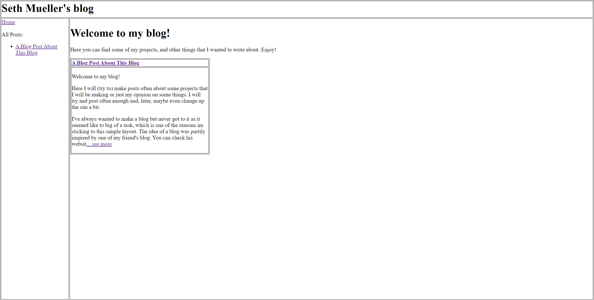

A Blog Post About This Blog
4/11/23
Welcome to my blog! 

Here I will (try to) make posts often about some projects that I will be making or just my opinion on some things. I will try and post often enough and, later, maybe even change up the site a bit.

I've always wanted to make a blog but never got to it as it seemed like to big of a task, which is one of the reasons im sticking to this simple layout. The idea of a blog was partily inspired by one of my friend's blog. You can check his website out at [johnlozier.com](https://www.johnlozier.com/). 

The first thing you might be thinking is "This website looks really basic." Well, luckily,  that was just the style I was going for. I am trying to model the styling after the very old web. Recently I found 2 old computers in my attic and a box of floppy discs to run on them (which I may write an article about later), inspireing this theme. I might change up the styling a bit later, but, for now, I will keep the table layout for a while.

_The first (and current) version of this blog_

To add to the theme of an older webpage, I also decided to challenge myself and not use any Javascript. I almost ended up not useing css either, but I decided against it. The entire website is rendered on the server, including the "... see more"s (which took a while to get working) and the post cards.

As of now, this is just a side project of mine so I may not work on designing the webpage as much, but it has been fun so far with my limited experience in doing front-end. Sorry if this article is a bit long, but if you made it this far, I hope you enjoyed it! See you in the next post!

(I may try and implement comments later, so look forward to that :) )